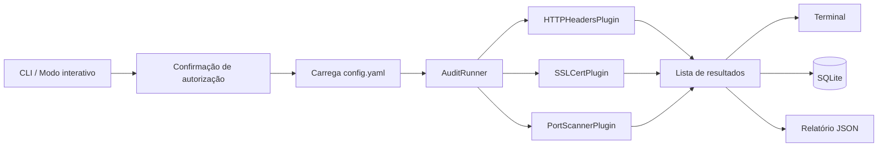

<div align="center">

# ShadowAudit

**Framework modular de auditoria de segurança em Python, baseado em plugins.**


```
   _____ __             __               ___             ___ __
  / ___// /_  ____ _____/ /___ _      __ /   |  __  ______/ (_) /_
  \__ \/ __ \/ __ `/ __  / __ \ | /| / // /| | / / / / __  / / __/
 ___/ / / / / /_/ / /_/ / /_/ / |/ |/ // ___ |/ /_/ / /_/ / / /_
/____/_/ /_/\__,_/\__,_/\____/|__/|__//_/  |_|\__,_/\__,_/_/\__/
```

</div>

---

## Sumário

- [Sobre](#sobre)
- [Aviso legal](#aviso-legal)
- [Como funciona](#como-funciona)
- [Arquitetura](#arquitetura)
- [Plugins disponíveis](#plugins-disponíveis)
- [Instalação](#instalação)
- [Uso](#uso)
- [Configuração](#configuração)
- [Saídas geradas](#saídas-geradas)
- [Criando um novo plugin](#criando-um-novo-plugin)
- [Testes](#testes)
- [Limitações conhecidas](#limitações-conhecidas)
- [Melhorias planejadas](#melhorias-planejadas)
- [Contribuindo](#contribuindo)
- [Licença](#licença)

---

## Sobre

O **ShadowAudit** é um framework de auditoria de segurança para ambientes **autorizados**. Cada verificação (análise de cabeçalhos HTTP, inspeção de certificado TLS, varredura de portas etc.) é implementada como um **plugin independente**, orquestrado por um *runner* central que padroniza a execução, o tratamento de erros, a persistência e a geração de relatórios.

Principais características:

- **Arquitetura extensível:** adicionar uma nova verificação exige apenas uma classe e uma linha de configuração.
- **Isolamento de falhas:** se um plugin falhar, os demais continuam sendo executados e o erro é registrado no resultado.
- **Persistência e relatórios:** resultados salvos em **SQLite** e exportados em **JSON**.
- **Dois modos de uso:** interativo (menu no terminal) ou direto via `--target`, adequado para scripts e CI.
- **Confirmação de autorização** antes de qualquer execução.
- **Logging** em console e em arquivo (`logs/shadowaudit.log`).
- **Testes automatizados** com `pytest`.

## Aviso legal

> **Use o ShadowAudit somente em sistemas que você possui ou para os quais tenha autorização explícita e por escrito para realizar testes.**
> Varreduras e testes contra alvos de terceiros sem permissão podem violar leis e termos de serviço. O autor não se responsabiliza pelo uso indevido desta ferramenta.

Por esse motivo, a ferramenta solicita uma confirmação de autorização antes de cada auditoria (que só pode ser ignorada explicitamente com `--yes`).

---

## Como funciona

O fluxo de uma auditoria é o seguinte:



1. **Entrada:** o alvo é informado via `--target` ou digitado no menu interativo. O alvo pode ser uma URL (`https://exemplo.com`) ou apenas um hostname (`exemplo.com`).
2. **Autorização:** o usuário confirma que tem permissão para auditar o alvo.
3. **Configuração:** o `config.yaml` define quais plugins estão habilitados, onde fica o banco de dados e onde os relatórios são gravados. Se o arquivo não existir, valores padrão são usados.
4. **Execução:** o `AuditRunner` instancia os plugins habilitados e executa cada um contra o alvo, em sequência. Exceções são capturadas e convertidas em um resultado com `status: "erro"`, sem interromper a auditoria.
5. **Normalização do alvo:** o utilitário `parse_target` extrai o host e identifica o uso de HTTPS. Alvos sem esquema assumem HTTPS.
6. **Saída:** os resultados são exibidos no terminal com formatação por plugin, gravados na tabela `audits` do SQLite e exportados como relatório JSON.

Todo plugin retorna um `dict` com, no mínimo, as chaves `plugin`, `target` e `status` (`executado`, `ignorado` ou `erro`).

---

## Arquitetura

```
ShadowAudit/
├── shadowaudit/
│   ├── main.py            # ponto de entrada e orquestração do fluxo
│   ├── cli.py             # definição dos argumentos (argparse)
│   ├── core/
│   │   ├── runner.py      # AuditRunner: executa e isola falhas dos plugins
│   │   ├── config.py      # leitura do config.yaml com valores padrão
│   │   ├── display.py     # formatação dos resultados no terminal
│   │   ├── banner.py      # banner e versão
│   │   └── logger.py      # logger (console + arquivo)
│   ├── plugins/
│   │   ├── base.py        # contrato AuditPlugin (classe abstrata)
│   │   ├── http_headers.py
│   │   ├── ssl_cert.py
│   │   ├── port_scanner.py
│   │   └── example.py     # plugin de referência
│   ├── database/db.py     # persistência em SQLite
│   ├── reports/report.py  # geração do relatório JSON
│   ├── utils/net.py       # parse_target (host e HTTPS)
│   └── scanners/          # reservado para evolução
├── tests/                 # testes automatizados (pytest)
├── config.yaml            # configuração do projeto
├── requirements.txt
└── LICENSE
```

**Princípios de design**

- **Contrato único de plugin:** `AuditPlugin` define `name` e o método abstrato `run(target) -> dict`.
- **Runner desacoplado dos plugins:** o runner só conhece o contrato, não as implementações.
- **Configuração declarativa:** os plugins são ativados pelo nome no YAML e resolvidos por um registro (`AVAILABLE_PLUGINS`).

---

## Plugins disponíveis

| Plugin | O que faz | Observações |
|---|---|---|
| **HTTPHeadersPlugin** | Verifica a presença dos cabeçalhos `Strict-Transport-Security`, `X-Content-Type-Options`, `X-Frame-Options` e `Content-Security-Policy`. | Tenta HTTPS e faz *fallback* para HTTP. Timeout de 10 s. |
| **SSLCertPlugin** | Lê o certificado TLS: protocolo negociado, titular, emissor, data de expiração e dias restantes. Sinaliza certificados expirados ou que expiram em até 30 dias. | Ignorado para alvos `http://` ou quando a porta 443 está fechada. Valida o certificado com o contexto padrão do Python. |
| **PortScannerPlugin** | *Connect scan* TCP (equivalente simplificado a `nmap -sT`) nas portas 21, 22, 23, 25, 53, 80, 110, 143, 443, 3306, 3389, 5432, 8080 e 8443. | Sem envio de payload além do *handshake* TCP. Concorrência com 20 threads e timeout de 1,5 s por porta. |
| **ExamplePlugin** | Plugin de referência para desenvolvedores. | Não realiza verificação real. |

---

## Instalação

**Requisitos:** Python 3.9 ou superior.

```bash
git clone https://github.com/K4KU404/ShadowAudit.git
cd ShadowAudit

python -m venv .venv
.venv\Scripts\activate         # Windows
source .venv/bin/activate      # Linux / macOS

pip install -r requirements.txt
```

Dependências: `PyYAML`, `requests`, `colorama` e `pytest`.

---

## Uso

**Modo direto** (executa uma vez e encerra, ideal para scripts):

```bash
python -m shadowaudit.main --target https://exemplo.com
```

**Modo interativo** (menu em loop no terminal):

```bash
python -m shadowaudit.main
```

**Uso em automação** (sem confirmação, sem banner e sem persistência em banco):

```bash
python -m shadowaudit.main -t exemplo.com --yes --no-banner --no-db
```

### Argumentos

| Argumento | Descrição |
|---|---|
| `--target`, `-t` | Alvo a ser auditado (URL ou hostname). |
| `--config`, `-c` | Caminho do arquivo de configuração (padrão: `config.yaml`). |
| `--no-db` | Não salva os resultados no banco de dados. |
| `--no-report` | Não gera o relatório JSON. |
| `--no-banner` | Não exibe o banner no terminal. |
| `--yes`, `-y` | Pula a confirmação de autorização (uso em CI/scripts). Use apenas em alvos autorizados. |

---

## Configuração

O arquivo `config.yaml` controla o comportamento padrão:

```yaml
database:
  path: database/shadowaudit.db

reports:
  output_dir: reports_output

plugins:
  enabled:
    - HTTPHeadersPlugin
    - SSLCertPlugin
    - PortScannerPlugin
```

Nomes de plugins desconhecidos são ignorados com um aviso no log. Se o arquivo não for encontrado, o ShadowAudit usa valores padrão e habilita apenas o `ExamplePlugin`.

---

## Saídas geradas

### Relatório JSON

Salvo em `reports_output/<alvo>_<timestamp>.json`:

```json
{
  "target": "exemplo.com",
  "generated_at": "2026-09-23T17:30:00+00:00",
  "total_plugins": 3,
  "results": [
    {
      "plugin": "HTTP Security Headers",
      "target": "exemplo.com",
      "status": "executado",
      "url_usada": "https://exemplo.com/",
      "status_code": 200,
      "headers_presentes": ["Strict-Transport-Security"],
      "headers_ausentes": ["X-Content-Type-Options", "X-Frame-Options", "Content-Security-Policy"]
    }
  ]
}
```

### Banco de dados SQLite

Salvo em `database/shadowaudit.db`, tabela `audits`:

| Coluna | Tipo | Descrição |
|---|---|---|
| `id` | INTEGER | Chave primária autoincrementada |
| `target` | TEXT | Alvo auditado |
| `plugin` | TEXT | Nome do plugin |
| `status` | TEXT | `executado`, `ignorado` ou `erro` |
| `result_json` | TEXT | Resultado completo em JSON |
| `created_at` | TEXT | Data/hora em UTC (ISO 8601) |

Exemplo de consulta:

```bash
sqlite3 database/shadowaudit.db \
  "SELECT created_at, target, plugin, status FROM audits ORDER BY id DESC LIMIT 10;"
```

### Logs

Eventos são registrados no console (nível `INFO`) e em `logs/shadowaudit.log` (nível `DEBUG`).

---

## Criando um novo plugin

**1. Crie a classe** em `shadowaudit/plugins/meu_plugin.py`:

```python
from shadowaudit.plugins.base import AuditPlugin
from shadowaudit.utils.net import parse_target


class MeuPlugin(AuditPlugin):
    name = "Meu Plugin"

    def run(self, target: str) -> dict:
        host, usa_https = parse_target(target)

        # lógica de auditoria aqui

        return {
            "plugin": self.name,
            "target": target,
            "status": "executado",
            "host": host,
        }
```

**2. Registre o plugin** em `AVAILABLE_PLUGINS`, no arquivo `shadowaudit/main.py`:

```python
from shadowaudit.plugins.meu_plugin import MeuPlugin

AVAILABLE_PLUGINS = {
    # ...
    "MeuPlugin": MeuPlugin,
}
```

**3. Habilite-o** no `config.yaml`:

```yaml
plugins:
  enabled:
    - MeuPlugin
```

**Boas práticas**

- Retorne sempre `plugin`, `target` e `status`.
- Use `status: "erro"` com a chave `error` para falhas esperadas e `status: "ignorado"` com `motivo` quando a verificação não se aplica.
- Defina timeouts em toda operação de rede.
- Para uma saída formatada no terminal, adicione um formatador em `shadowaudit/core/display.py`; caso contrário, o formato genérico é usado.

---

## Testes

```bash
pytest -v
```

A suíte atual cobre o `AuditRunner` (incluindo captura de falhas em plugins), a persistência em SQLite e o `parse_target`.

---

## Limitações conhecidas

Para transparência sobre o estado atual do projeto (versão `0.1.0`):

- O `HTTPHeadersPlugin` verifica apenas a **presença** dos cabeçalhos, não a qualidade dos valores (por exemplo, `max-age` do HSTS ou diretivas inseguras na CSP).
- O `PortScannerPlugin` usa somente **IPv4**, uma lista fixa de portas e não realiza identificação de serviço além do nome padrão da porta.
- O `SSLCertPlugin` não avalia cifras, versões de protocolo suportadas ou a cadeia de certificação em detalhe.
- A auditoria processa **um alvo por vez** e os plugins são executados de forma **sequencial**.
- Os resultados não possuem classificação de severidade.
- O diretório `scanners/` está reservado e ainda sem implementação.
- Plugins novos precisam ser registrados manualmente em `AVAILABLE_PLUGINS`.

---

## Melhorias planejadas

### Curto prazo: qualidade e usabilidade

- [ ] Permitir configurar as **portas** e **timeouts** pelo `config.yaml`.
- [ ] Flag `--plugins` para escolher plugins na linha de comando.
- [ ] **Códigos de saída** que reflitam os achados (útil em pipelines de CI).
- [ ] Empacotamento com `pyproject.toml` e comando `shadowaudit` instalável via `pip`.
- [ ] Mesclagem profunda (*deep merge*) da configuração carregada com os valores padrão.
- [ ] Arquivo `.gitignore` cobrindo `logs/`, `reports_output/`, `database/*.db` e `.venv/`.
- [ ] Ampliar testes (plugins com *mocks* de rede, relatório JSON, `Config`) e medir cobertura.
- [ ] Lint e tipagem estática (`ruff`, `mypy`) integrados ao CI.

### Médio prazo: profundidade das verificações

- [ ] **Sistema de severidade** (informativo, baixa, média, alta, crítica) e pontuação geral do alvo.
- [ ] Validação de **valores** dos cabeçalhos e inclusão de `Referrer-Policy`, `Permissions-Policy`, `Cross-Origin-*` e flags de cookies (`Secure`, `HttpOnly`, `SameSite`).
- [ ] TLS avançado: versões e cifras suportadas, validação de hostname/SAN e cadeia de certificados.
- [ ] Port scanner com **IPv6**, perfis de portas (rápido, comum, completo) e *banner grabbing* opcional.
- [ ] Novos plugins: DNS (SPF, DKIM, DMARC), `security.txt`/`robots.txt`, CORS, redirecionamento HTTP para HTTPS e detecção de tecnologias.
- [ ] **Sistema de evidências:** armazenar requisições/respostas relevantes associadas a cada achado.
- [ ] Descoberta automática de plugins (via *entry points* ou varredura do pacote), eliminando o registro manual.
- [ ] Execução **concorrente** de plugins e suporte a **múltiplos alvos** (lista/arquivo).

### Longo prazo: ecossistema

- [ ] Relatórios em **HTML**, **Markdown** e **SARIF**.
- [ ] Comparação entre auditorias (histórico e *diff* de achados ao longo do tempo).
- [ ] **Dashboard web** para visualização dos resultados armazenados.
- [ ] API REST para integração com outras ferramentas.
- [ ] Controle de escopo (lista de alvos permitidos) e *rate limiting* para reforçar o uso responsável.
- [ ] Imagem **Docker** oficial.

---

## Contribuindo

Contribuições são bem-vindas.

1. Faça um *fork* do repositório.
2. Crie uma branch para sua alteração: `git checkout -b feature/minha-feature`.
3. Adicione testes para o que foi implementado e execute `pytest -v`.
4. Envie um *pull request* descrevendo a mudança.

Sugestões e relatos de problemas podem ser abertos na aba **Issues**. Vulnerabilidades no próprio ShadowAudit devem ser reportadas de forma privada ao mantenedor antes de divulgação pública.

---

## Licença

Distribuído sob a licença **MIT**. Consulte o arquivo [LICENSE](LICENSE) para mais detalhes.

<div align="center">

Desenvolvido por [K4KU404](https://github.com/K4KU404)

</div>
